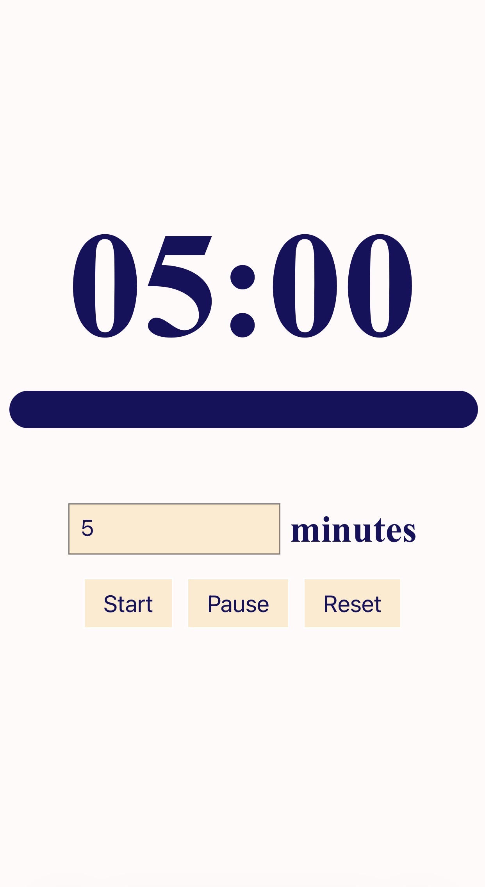

## Live demo
[Link here](https://wolfepackharry.github.io/Visual-Timer/)

## How to use
1. Type how many minutes you want.
2. Hit Start.
3. Watch the bar shrink as time runs out.
4. Pause or Reset anytime.

## Screenshot

